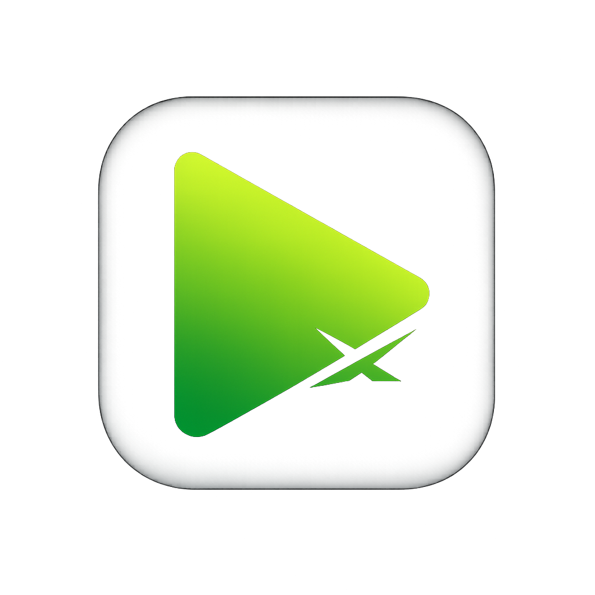

<!-- codex-branding:start -->
<p align="center"></p>

<p align="center">
  
  
  
</p>
<!-- codex-branding:end -->

# RumbleX

   

**The ultimate Rumble enhancement suite.** 130+ feature modules across 14 categories — ad blocking, theater mode, video downloads with CDN deep-scan probing, five-theme engine (now including OLED Green), playback controls, chat enhancements with deterministic username colors and tier-filtered rants, chapters, SponsorBlock, clips, live DVR, transcripts, auto-hide chrome, 50+ granular hide-X toggles for every Rumble row/button/player control, thumbnail hider, dense mode, reduced-motion path, tracking-param stripping, external player handoff (MPV/PotPlayer), and full-round-trip backup/restore with snapshot history. Chrome MV3 + Firefox MV2 + userscript.

### What's new in v2.x

- **v2.0** — Core engine: schema-v2 migration, selector registry (27 named surfaces with stable+fallback selectors), route lifecycle (history + htmx hooks), 70+ new settings keys, OLED Green theme.
- **v2.1** — Premium UI superset: thumbnail hider (master/feeds/related scopes), dense mode, account-pagination compaction, reduced-motion path, home cleanup presets (focused/minimal/custom), DarkEnhance now writes Rumble's native CSS tokens.
- **v2.2** — Download Manager 2.0 phase 1: external player handoff (MPV/PotPlayer/custom URI), shared media probe cache with TTL.
- **v2.3 / v2.4** — Live chat hardening + feed moderation: rant-tier filter, chat username colors (deterministic/tiered), keyword-filter modes (literal/regex/wildcard), tracking-param stripping (e9s, utm_*, fbclid, gclid, etc.).
- **v2.6** — Privacy & data: privacy report API, backup-snapshot history, selector-telemetry export.

## Features

### Ad Blocking
- **Ad Nuker** — CSS + DOM removal of ads, pause overlays, premium nags, IMA SDK, LRT
- **Feed Cleanup** — Remove premium promos from feeds
- **Hide Reposts** — Hide reposted videos from feeds
- **Hide Premium** — Hide premium/PPV videos via CSS `:has()`
- **Shorts Filter** — Hide Shorts cards from all feeds
- **SponsorBlock** — Per-video local segments with auto-skip (sponsor / intro / outro / selfpromo / interaction), progress-bar markers, JSON import + export

### Video Player
- **Theater Split** — Fullscreen video with scroll-to-reveal side panel (chat/comments/download)
- **Auto Theater** — Auto-enter native theater mode on load
- **Full-Width Player** — Maximize player width; on live streams, side-by-side chat layout with responsive stacking ≤ 1100 px
- **Adaptive Live Layout** — Expand main content whenever chat is visible on live streams
- **Speed Control** — Persistent playback speed (0.25x–3x) with live stream detection
- **Scroll Volume** — Mouse wheel volume + middle-click mute + overlay
- **Auto Max Quality** — Auto-select highest resolution on load
- **Autoplay Block** — Prevent auto-play of next video
- **Loop Control** — Full video loop + A-B segment loop
- **Mini Player** — Floating draggable video when scrolling away
- **Keyboard Nav (legacy)** — YouTube-style hotkeys (J/K/L, F, M, 0-9, arrows). Disabled by default in v2 — visible controls preferred; flip on under **Core** if you still want them.
- **Video Stats** — Resolution, codec, buffer, frames overlay
- **Chapters** — Parse description timestamps, render tick marks on the seek bar + clickable chapter list
- **Autoplay Queue** — FAB-pinned queue of Rumble URLs, auto-advances when current video ends

### Theme & Layout
- **Dark Theme** — Multi-theme engine with 4 built-in themes and player bar coloring
  - Catppuccin Mocha (default) — Purple/blue accents
  - YouTubify — YouTube dark-mode look with red accent and progress bar
  - Midnight AMOLED — Pure black with indigo accents
  - Rumble Green — Dark with Rumble's native green identity
- **Site Theme Sync** — Mirror Rumble's native system / dark / light setting
- **Wide Layout** — Full-width responsive grid on home and subscriptions
- **Auto-Hide Header** — Fade the header out, reveal on top-edge cursor
- **Auto-Hide Nav Sidebar** — Hide nav, reveal on left-edge hover (30-px trigger strip)
- **Logo to Feed** — Rumble logo navigates to Subscriptions feed
- **Auto Expand** — Auto-expand descriptions and comments
- **Auto Load Comments** — Scroll-triggered *Show more comments* clicks
- **Notif Enhance** — Themed notification dropdown + bell pulse
- **Full Titles** — Remove title truncation on video cards
- **Title Font** — Unbold + normalize title typography

### Downloads & Capture
- **Video Download** — Download as direct MP4 or HLS-to-MP4/TS via Web Worker transmuxing. Includes an automatic **Deep Scan (RUD)** that probes `hugh.cdn.rumble.cloud` for every quality variant the embed API didn't surface (1080p/720p/480p/360p/240p × mp4/tar × live/vod), with live progress bar, per-row copy-link buttons, and support for TAR live-replay archives (with inline *extract with 7-Zip, drop the `.m3u8` into VLC* hint).
- **Low-Bitrate MP4 (for listening)** — Download the smallest video variant for background audio (saved as `.mp4` — honest naming; Rumble doesn't expose a pure audio track).
- **Video Clips** — Mark In/Out on the player and export a clip as MP4 (segment slicing + transmux)
- **Live DVR** — Save the last 30 s / 1 m / 5 m / 10 m of a live stream as MP4
- **Batch Download** — Multi-select thumbnails across feeds to bulk-download direct MP4s
- **Screenshot** — Capture current video frame as PNG
- **Share@Time** — Copy video URL at current playback timestamp
- **Subtitle Sidecar** — Load local SRT/VTT and overlay captions on the player
- **Transcripts** — Clickable, searchable transcript panel synced to the player

### History & Bookmarks
- **Watch Progress** — Save/resume position + red progress bars on thumbnails
- **Watch History** — Local browsable watch history with search
- **Search History** — Recent searches dropdown on search input
- **Bookmarks** — Save videos locally for later (200 max)
- **Quick Save** — Watch Later button on thumbnail hover

### Comments & Chat
- **Auto Like** — One-shot auto-click of the like button on watch pages
- **Comment Blocking** — Per-commenter block list with inline block button on every comment (parallel to the existing chat user-block)
- **Chat Enhance** — @mention highlights (TreeWalker-safe — no `innerHTML` round-trip), message filter bar
- **Chat Scroll** — Smart auto-scroll with pause on scroll-up
- **Unique Chatters** — Live counter of unique chatters + total messages above chat
- **User Block** — Per-user chat hide with inline block button on every message
- **Spam Dedup** — Hide recently-repeated identical messages (30-message rolling window)
- **Chat Export** — TXT (click) or JSON (shift-click) export including rant amounts
- **Popout Chat** — Open chat in a separate resizable window (uses Rumble's native popout where available)
- **Timestamps** — Clickable timestamps in comments and description
- **Comment Nav** — Navigate, expand/collapse, OP-only filter
- **Comment Sort** — Reorder comments: Top / New / Oldest / Controversial
- **Rant Highlight** — Glow rants by tier + running $ total
- **Rant Persist** — Keep rants visible past their expiry + per-video cache + JSON export

### Feed Controls
- **Channel Blocker** — Block/hide channels from all feeds
- **Keyword Filter** — Hide videos whose titles contain blocked keywords
- **Related Filter** — Search and filter related sidebar videos
- **Exact Counts** — Show full numbers instead of 1.2K/3.5M abbreviations

### Hide-X Toggles (50 modules, all opt-in)
Driven by the `RX_CSS_TOGGLES` registry — each toggle is a proper feature module with its own setting key, hot-reload support, and options-page card:

| Group | Count | Sample toggles |
|---|---|---|
| Main Page Layout | 25 | `widenSearchBar`, `hideUploadIcon`, `hideHeaderAd`, `hideFeaturedBanner`, `hideForYouRow`, `hideGamingRow`, `hideFinanceRow`, `hideNewsRow`, `hideSportsRow`, `hideFooter`, … |
| Video Page Layout | 5 | `hideRelatedOnLive`, `hideRelatedSidebar`, `widenContent`, `hideVideoDescription`, `hidePausedVideoAds` |
| Player Controls | 9 | `hideRewindButton`, `hideCCButton`, `hideAutoplayButton`, `hideTheaterButton`, `hidePipButton`, `hideFullscreenButton`, `hidePlayerRumbleLogo`, `hidePlayerGradient`, … |
| Video Buttons | 8 | `hideLikeDislikeButton`, `hideShareButton`, `hideRepostButton`, `hideEmbedButton`, `hideSaveButton`, `hideCommentButton`, `hideReportButton`, `hidePremiumJoinButtons` |
| Comments | 2 | `moveReplyButton`, `hideCommentReportLink` |
| Chat | 1 | `cleanLiveChat` |

## Settings

### Options Page (full editor)
Click the extension icon → **gear button** to open the dedicated options page. Modelled on Astra-Deck's settings workspace:
- App bar with version + live storage status
- Workspace hero + **Open Settings Editor** CTA
- 5-card stats overview (Enabled features, Storage size, Channels, Keywords, Chatters)
- **Full-parity Export / Import** — backups now include both `rx_settings` AND per-origin localStorage (watch progress, watch/search history, bookmarks, volume memory, rant archives). Export format: `exportVersion: 2`; v1 imports still work. Imports are allowlisted by key so a crafted file cannot smuggle arbitrary localStorage keys onto rumble.com.
- **Reset All Data** broadcasts `clearLocalData` to every open Rumble tab and reports the honest "Cleared N per-site keys across M tabs" count
- **Settings editor modal** with dirty-draft workflow: search, sidebar group nav (9 groups), chips for unsaved / needs-attention, Restore Defaults / Discard / Save toolbar, per-field Reset buttons
- Per-control editors infer from value type: toggle / number / text / textarea / list / JSON / enum-dropdown (theme & siteTheme)
- Focus trap, `beforeunload` guard on unsaved draft, live re-sync via `chrome.storage.onChanged`

### In-page Quick Modal (on-tab)
Press **Ctrl+Shift+X** on any Rumble page (or **shift-click** the popup gear) to open the original in-page settings modal with:
- 7 categorized sidebar tabs with color-coded icons
- Theme picker with live preview dots
- Playback speed slider
- Homepage category visibility toggles
- Blocked channels / keywords / chatters chip lists
- Hot-reload: most features re-init without a page reload

### Popup
Click the extension icon for quick toggles, grouped by category with enabled-count badges:
- 7 collapsible category groups
- Debounced writes (120 ms) with `pagehide` flush — rapid toggles coalesce into one write
- **Settings gear** — Opens the options page (shift-click for in-page modal)
- **GitHub link** — Direct link to this repository
- **Update checker** — Checks GitHub Releases for new versions

## Install

### Chrome / Edge / Brave (MV3)
1. Grab `RumbleX-chrome.zip` from [Releases](https://github.com/SysAdminDoc/RumbleX/releases)
2. Extract the zip
3. Visit `chrome://extensions` and enable **Developer mode**
4. Click **Load unpacked** and select the extracted folder

Or drag `RumbleX-v1.9.3.crx` directly onto `chrome://extensions` (Developer mode on).

### Firefox (109+)
1. Download `RumbleX-firefox.zip` from [Releases](https://github.com/SysAdminDoc/RumbleX/releases)
2. Go to `about:debugging#/runtime/this-firefox`
3. Click **Load Temporary Add-on** and select `manifest.json` inside the extracted folder

### Tampermonkey (Userscript)
Install `RumbleX.user.js` directly — note: the userscript version lags behind the extension on download features (no Web Worker / mux.js bundle).

## Tech Stack
- Vanilla JavaScript — no frameworks, no build step
- Chrome Extension Manifest V3 + Firefox Manifest V2 (parallel manifests)
- `chrome.storage.local` for settings persistence
- `localStorage` (per-origin) for watch progress, volume memory, history, rant archives
- mux.js (bundled) for HLS segment transmuxing in a Web Worker
- `AbortController` + generation-counter guards for cancellable async work
- Anti-FOUC: CSS injected at `document_start`
- GitHub Releases API for update checking
- Download host allowlist (`rumble.com`, `1a-1791.com`, `rumble.cloud`) enforced in the background worker

## Security Notes
- All download URLs are validated against a host allowlist before hitting `chrome.downloads`.
- `LiveChatEnhance` uses a `TreeWalker` on `Text` nodes only — Rumble's chat markup is never re-parsed through `innerHTML`.
- Download UI is built via DOM APIs; no network-influenced text (error messages, response bodies, CDN probe results) ever reaches the HTML parser.
- Backup imports are allowlisted: `setLocalData` rejects any key outside the `RX_LOCAL_STORAGE_KEYS` list + `rx_rants_` prefix, so a crafted file cannot write arbitrary keys to rumble.com's origin.

## Build
```bash
cd extension
./build.sh       # produces RumbleX-chrome.zip and RumbleX-firefox.zip in the parent dir
```
Requires `zip` (Git Bash on Windows: use PowerShell `Compress-Archive` fallback). See `CHANGELOG.md` for per-version details.

## License
MIT
