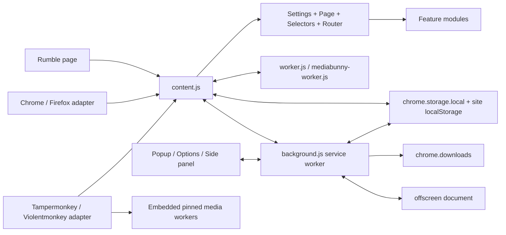

# RumbleX

   

**The ultimate Rumble enhancement suite.** 130+ feature modules across 14 categories — ad blocking, theater mode, video downloads with CDN deep-scan probing and an opt-in Mediabunny muxer path, five-theme engine (now including OLED Green), playback controls, chat enhancements with deterministic username colors and tier-filtered rants, chapters, SponsorBlock, clips, live DVR, transcripts, auto-hide chrome, 50+ granular hide-X toggles for every Rumble row/button/player control, thumbnail hider, dense mode, reduced-motion path, tracking-param stripping, external player handoff (MPV/PotPlayer), and full-round-trip backup/restore with snapshot history. Chrome MV3 + Firefox MV2 + userscript.

### What's new in v3.50

Downloads, captions and creator numbers, plus a notifier that had quietly stopped working.

- **Downloads can drop the segments you marked.** Mark a sponsor read with SponsorBlock and the download can leave it out. It works on whole stream segments so nothing is re-encoded, which means a second or two of a mark can survive at each edge. The panel tells you how much it will drop before you start.
- **Captions load themselves.** Rumble publishes creator-uploaded caption tracks, and RumbleX now picks them up. The transcript fills in without a file picker, and other languages appear as buttons.
- **The channel notifier was reading markup Rumble no longer ships**, so new uploads went unnoticed and live streams never registered. It reads the listing data the page is actually built from now, and a live alert opens the stream rather than the channel page.
- **A Creator Program panel** on channel pages, counting this month's shorts against the program's 20.
- Marked segments are written into download sidecars as chapters, in the format Jellyfin and Kodi already read.

### What's new in v3.49

Live chat got the things every other chat platform already has, and rants became something you can total up.

- **Mention autocomplete.** Type `@` and RumbleX offers the people who have actually spoken this session, ranked so prefix matches come first. Arrow keys and Escape work the way you expect.
- **Keyword highlight.** Name the terms you care about and matching messages stand out, with an optional short tone. Matching covers the sender's name as well as the message.
- **User cards.** Click a name for what that person has said this session, plus mention, block, and a local nickname that sticks. Renaming is fully reversible.
- **Chat readability.** Alternating row shading, adjustable chat text size, and an option to keep deleted messages visible struck through instead of having them vanish.
- **Rant archive.** Totals, top supporters, and a CSV or JSON export of the rants captured for a video.

### What's new in v3.48

- **SponsorBlock skip controls.** Each category can auto-skip, skip only the first time, or just say the segment is there. Every skip offers an Undo for five seconds, the panel keeps a running total of time skipped, and three categories were added, including flashing lights.
- **Playback settings per channel.** Volume, speed and an optional quality ceiling are remembered for each channel, so a podcast at 1.75x doesn't force a music channel to the same speed.
- **Downloads bring their metadata.** An `.info.json`, a Jellyfin/Kodi `.nfo` and the thumbnail can be saved alongside a video, named to match so a media server pairs them.
- **Channel RSS, generated locally.** Rumble has no per-channel RSS and server-side generators get rate-blocked. This one builds the feed from the page you're already on, so there's nothing to block.
- **Title Normalizer**, off by default: calms ALL CAPS, emoji spray and repeated `!!!` while leaving ordinary titles and acronyms alone.

### What's new in v3.47

- **A project page, and a way to check what you downloaded.** Install instructions for every browser now live at <https://sysadmindoc.github.io/RumbleX/>, along with the commands to verify a release. Release checksums can be signed, and a signature that doesn't match the published key stops the build instead of shipping.
- **Mediabunny is the default converter.** mux.js hasn't had a commit since October 2024; Mediabunny fixed three bugs in the exact conversion path RumbleX uses this summer. mux.js stays as the automatic fallback wherever WebCodecs isn't available, so nothing is lost.
- **Exact view counts on watch pages.** Rumble publishes structured data for search engines that includes the real numbers, the true duration and the upload date. RumbleX reads it now, and the local health report tracks it as its own layer.
- **Time Remaining**, off by default: how much is left at the speed you're actually watching, and the clock time you'll finish.

### What's new in v3.41

- **Trust-boundary fix for the notifier webhook** — `discordWebhookUrl` reached an outbound request without any URL validation, so a crafted backup, snapshot, or encrypted-Gist restore could silently install an arbitrary destination for followed-channel activity. Only HTTPS Discord webhook endpoints are accepted now, the destination is re-checked before every POST, and a configured webhook is listed in the local Privacy Report.
- **No more hangs and no more downgrade prompts** — the default mux.js converter is bounded by the same termination watchdog the experimental engine already had, and the update check compares versions numerically instead of by string, so a published release older than your build is no longer advertised as an update.
- **Failures stop reporting success** — popup toggles surface a banner when a write fails, a feature whose startup throws reverts its own switch instead of claiming it turned on, and the local error ring records on every page so a bug report has something to attach.
- **Reset fails closed** — Reset All Data has no confirmation dialog by design because the pre-reset snapshot is the undo; if that snapshot cannot be captured, the reset now aborts instead of wiping anyway.

### What's new in v3.40

- **Calmer infinite feeds and live pages** — twelve default-on DOM features now coalesce bursty Rumble/htmx mutations into at most one full-surface pass per animation frame, and disabling a feature cancels queued frame work.
- **Clean player replacement** — Speed Control and Scroll Volume release listeners and state from detached videos when Rumble swaps the player, then bind the replacement video and volume popup without retaining stale nodes.
- **Reversible exact counts** — disabling Exact Counts restores Rumble's original abbreviated text, classes, and markers instead of leaving host content permanently rewritten.

### v3.39 highlights

- **Catalog-wide feature verification** — all 75 handwritten modules and all 51 CSS toggles now have registry, initialization, teardown, and route-aware regression coverage; the browser suite also exercises current search cards and destructive account tools in dry-run mode.
- **Reliable hot toggles** — cancellable feature waits and timers prevent disabled modules from reviving controls, observers, or listeners after Rumble finishes an htmx render. Speed, volume, timestamps, history, chat, comments, SponsorBlock, queue, export, and media-sidecar cleanup paths were hardened.
- **Current Rumble routes and cards** — modern `article.video-item` search results now work with quick-save, batch download, progress, filters, title/thumbnail controls, and health checks. Bulk Unsubscribe recognizes `/followed-channels` and `/account/recurring-subs`, and Wallet Tip recognizes the current QR endpoint.

### v3.38 highlights

- **One settings trust boundary** — content scripts, options, popup, Chrome and Firefox backgrounds, and the generated userscript now consume the same canonical defaults and schema normalizer.
- **Safe profile and encrypted-Gist recovery** — legacy or crafted restores cannot inject unknown keys, invalid enums/types, off-site autoplay URLs, CSS-shaped categories, malformed notifier channels, or unsafe SponsorBlock data. Gist pulls keep the local token and Gist ID instead of trusting the remote copy.
- **Smaller runtime surface** — removed more than 1,000 lines of duplicated defaults and validation logic while adding direct schema and hostile-restore regression tests.

### v3.46 highlights
- **Every error raised during boot was silently discarded.** `RxErrorLog.record()` carried a readiness guard left over from when capture consulted a setting; it threw away the one window a user cannot retry, so the diagnostics export was empty for exactly the failures worth reporting.
- **Two intermittent test failures, root-caused rather than re-run until green.** The first was that same guard, reproduced deterministically. The second was a bare `locator.count()` racing an asynchronous render.
- **French and Italian at full parity — six locales, 433 keys each.** The blocker they clear had demanded install heat maps from a project that deliberately ships no telemetry; the replacement criterion needs no analytics at all.

### v3.45 highlights
- **Playback resilience.** `AutoMaxQuality` always pinned the highest rendition, which is the worst possible answer to buffering. It now honours a quality ceiling and floor, and `qualityMode` — which shipped with four documented values and no runtime consumer at all. Three stalls inside 30 seconds drops one rendition and says why.
- **`/playlists/<id>` is a route RumbleX understands.** Batch Download mounts and multi-selects there, and Channel Archive can enqueue a whole playlist. This also fixed the archive parser, which only matched relative card hrefs and so would have found nothing on a playlist page.
- **Document Picture-in-Picture.** Where the API exists, the mini player pops out into a real always-on-top window instead of a floating div that dies on navigation.
- **Store listing assets**, with a guard that fails on an unjustified permission or a mis-sized image. Capturing the 640x400 screenshot exposed a layout bug: the settings modal's narrow-viewport rules sat above the desktop rules they override, so in a small window the sidebar and content pane collapsed.

### v3.44 highlights
- **The in-page UI is actually translated now.** `content.js` had zero i18n calls, so four locales covered the extension's own pages while every string on rumble.com stayed English. 313 keys are wired: every toast, the download panel, and the whole settings modal including all 137 feature labels and 124 descriptions, in German, Spanish and Brazilian Portuguese. Feature search indexes the translated text, so searching in German finds German.
- **Five injected controls were unreachable without a mouse** — description timestamps, blocked-list chips, progress-bar chapter markers, transcript rows and the batch-download selection toggle were all click-only `<div>`/`<span>` elements. All 22 injected surfaces now get a per-surface axe WCAG 2.2 AA scan, which also caught secondary text failing contrast at 3.35:1 and four buttons under the 24x24 target-size minimum.
- **Six features could not be re-enabled without reloading the page.** Their `destroy()` detached the panel but kept the reference, and the mount guard reads that reference. Found by the new per-surface scan, which could not mount three of them for exactly this reason.

### v3.43 highlights
- **Settings written during startup are no longer discarded.** `Settings.init()` replaced the whole cache and reset its pending-write set, so any save that landed while it was still reading storage vanished while reporting success. This was also the root cause of an intermittent test failure that had been reproducing roughly one run in three.
- **Two injected controls were unreachable by keyboard** — chapter rows and the search-history delete control were click-only `<div>`/`<span>` elements. Both are real buttons now, and twelve injected panels that carried zero `aria` attributes have roles and accessible names.
- **Behavioral tests for the 21 modules that were only proven to mount.** Mounting is not behavior: these now assert stripped parameters, parsed chapters, persisted history, skipped segments, CSV escaping, and that MiniPlayer tears out its cloned `<video>` instead of leaving it decoding audio.

### v3.42 highlights
- **Settings that do nothing now say so.** 41 of 210 keys rendered live controls that no runtime code read — flip the switch, watch it save, nothing happens. Two were wired up (`encryptedGistSync`, `privacyReport`), two dead duplicates were removed with a schema migration, and the remaining 38 are labelled "Not implemented yet" with a stated reason and disabled inputs. A guard fails in both directions so the list cannot rot.
- **First-run welcome** naming eight default-off, genuinely-wired presets, applied in one click. Dismissible, shown once, writes nothing if you decline.
- **Deleting a settings profile is reversible** — inline Undo plus a pre-delete snapshot. The pre-*switch* snapshot never actually fired before this release either.
- **`a-delivery.rmbl.ws` is blocked.** It is a CNAME alias of the already-blocked ad host, and hostname matching never follows CNAMEs, so it had been passing through every runtime. All three hand-synced host lists are now machine-checked against each other.
- **`RumbleX.lite.user.js`** — a Greasy Fork-compliant build with the same shared runtime, minus the bundled transmuxers.
- **One `aria-live` announcer** for all in-page feedback, replacing three implementations of which only one was announced to assistive tech.
- Release packages are staged instead of mutating the working tree; Mediabunny upgraded to 1.55.1.

### v3.37 highlights

- **Large HLS without tab-sized buffering** — supported Chromium desktops can stream a selected HLS quality directly into a user-chosen `.ts` file, one response chunk at a time. Cancellation aborts the network reader and staged file write; MP4 remuxing remains safely capped at 512 MiB.
- **Visible drift detection** — the local Privacy Report now identifies critical route selectors as healthy, fallback, or broken, and a missing high-value anchor produces a one-time in-page warning instead of silently disabling features.
- **Proven Firefox MV2 runtime** — a repeatable Firefox temporary-addon smoke covers content injection, storage, deletion, response messaging, and bundled media assets. Shield UI now distinguishes Chromium DNR, Firefox `webRequest`, and manager-dependent userscripts.

- **One shared feature core** — Chrome MV3, Firefox MV2, Tampermonkey, and Violentmonkey now execute the same canonical page-feature code. A build-time guard rejects stale userscripts, version drift, missing settings/modules, direct `chrome.*` use, and remote code loading.
- **Current Rumble support** — modern `<rum-video-thumbnail>` cards, SPA watch-route changes, visible action anchors, and every current embed HLS response shape are covered by committed fixtures and loaded-extension tests.
- **Safer downloads and imports** — downloads are cancellable and bounded before large media can exhaust tab memory; imported settings, snapshots, queue URLs, and compressed backups are size- and schema-validated.
- **Complete local media bundle** — the userscript embeds the pinned mux.js and Mediabunny workers/libraries. It never fetches or evaluates executable code from a CDN.
- **Request-level ad shield** — Chrome/Edge/Brave use a Rumble-scoped MV3 ruleset and Firefox uses a scoped MV2 blocking listener for the verified ad-delivery/measurement surface; Ad Nuker remains the DOM cleanup layer for sponsored cards, overlays, and reserved space.
- **Desktop settings redesign** — the options control center, complete settings editor, popup, and in-page modal now share an OLED-black/Rumble-green system with clearer discovery, network-shield state, save/reset feedback, and verified 1440×900 and 1920×1080 layouts.

### Earlier v2.x milestones

- **v2.0** — Core engine: schema-v2 migration, selector registry (27 named surfaces with stable+fallback selectors), route lifecycle (history + htmx hooks), 70+ new settings keys, OLED Green theme.
- **v2.1** — Premium UI superset: thumbnail hider (master/feeds/related scopes), dense mode, account-pagination compaction, reduced-motion path, home cleanup presets (focused/minimal/custom), DarkEnhance now writes Rumble's native CSS tokens.
- **v2.2** — Download Manager 2.0 phase 1: external player handoff (MPV/PotPlayer/custom URI), shared media probe cache with TTL.
- **v2.3 / v2.4** — Live chat hardening + feed moderation: rant-tier filter, chat username colors (deterministic/tiered), keyword-filter modes (literal/regex/wildcard), tracking-param stripping (e9s, utm_*, fbclid, gclid, etc.).
- **v2.6** — Privacy & data: privacy report API, backup-snapshot history, selector-telemetry export.

## Features

### Ad Blocking
- **Network Shield (extension)** — blocks the verified Rumble ad-delivery and measurement request surface before page code runs. Chrome-family browsers use seven Rumble-scoped Declarative Net Request rules; Firefox uses its scoped blocking webRequest listener.
- **Ad Nuker** — CSS + DOM cleanup of ad containers, pause overlays, premium nags, sponsored units, and reserved whitespace, including content reinserted after navigation.
- **Feed Cleanup** — Remove premium promos from feeds
- **Hide Reposts** — Hide reposted videos from feeds
- **Hide Premium** — Hide premium/PPV videos via CSS `:has()`
- **Shorts Filter** — Hide Shorts cards from all feeds
- **Platform Cleanup** — Optionally redirect the dedicated Shorts feed, hide Rumble Wallet tip controls, and remove Premium/Perplexity promos
- **SponsorBlock** — Per-video local segments with auto-skip (sponsor / intro / outro / selfpromo / interaction), progress-bar markers, JSON import + export, and an opt-in trim that keeps marked segments out of downloads

### Video Player
- **Theater Split** — Fullscreen video with scroll-to-reveal side panel (chat/comments/download)
- **Auto Theater** — Auto-enter native theater mode on load
- **Full-Width Player** — Maximize player width; on live streams, side-by-side chat layout with responsive stacking ≤ 1100 px
- **Adaptive Live Layout** — Expand main content whenever chat is visible on live streams
- **Speed Control** — Persistent playback speed (0.25x–3x) with live stream detection
- **Scroll Volume** — Mouse wheel volume + middle-click mute + overlay
- **Auto Max Quality** — Auto-select highest resolution on load
- **Autoplay Block** — Prevent auto-play of next video
- **Loop Control** — Full video loop + A-B segment loop
- **Mini Player** — Floating draggable video when scrolling away
- **Keyboard Nav (legacy)** — YouTube-style hotkeys (J/K/L, F, M, 0-9, arrows). Disabled by default in v2 — visible controls preferred; flip on under **Core** if you still want them.
- **Video Stats** — Resolution, codec, buffer, frames overlay
- **Chapters** — Parse description timestamps, render tick marks on the seek bar + clickable chapter list
- **Autoplay Queue** — FAB-pinned queue of Rumble URLs, auto-advances when current video ends

### Theme & Layout
- **Dark Theme** — Multi-theme engine with 5 built-in themes and player bar coloring
  - Catppuccin Mocha (default) — Purple/blue accents
  - YouTubify — YouTube dark-mode look with red accent and progress bar
  - Midnight AMOLED — Pure black with indigo accents
  - Rumble Green — Dark with Rumble's native green identity
  - OLED Green — Near-black OLED surfaces with Rumble-green accents
- **Site Theme Sync** — Mirror Rumble's native system / dark / light setting
- **Wide Layout** — Full-width responsive grid on home and subscriptions
- **Auto-Hide Header** — Fade the header out, reveal on top-edge cursor
- **Auto-Hide Nav Sidebar** — Hide nav, reveal on left-edge hover (30-px trigger strip)
- **Logo to Feed** — Rumble logo navigates to Subscriptions feed
- **Auto Expand** — Auto-expand descriptions and comments
- **Auto Load Comments** — Scroll-triggered *Show more comments* clicks
- **Notif Enhance** — Themed notification dropdown + bell pulse
- **Full Titles** — Remove title truncation on video cards
- **Title Font** — Unbold + normalize title typography

### Downloads & Capture
- **Video Download** — Download direct MP4, bounded HLS-to-MP4, or raw HLS TS. On Chromium desktops with the File System Access picker, **TS to disk** writes each response chunk directly to a selected file and supports cancellation without retaining the complete stream in memory; Firefox and unsupported userscript environments keep the 512 MiB in-tab ceiling and direct/TAR fallbacks. Default MP4 engine is the pinned mux.js path; advanced settings include an experimental Mediabunny + WebCodecs engine with golden-sample output parity and bounded fallback to mux.js when WebCodecs, module startup, or conversion is unavailable. RumbleX-owned browser transfers pause on offline events and queue safe ID-only resumes for the next online event, without persisting signed media URLs. Includes an automatic **Deep Scan (RUD)** that probes `hugh.cdn.rumble.cloud` for every quality variant the embed API didn't surface (1080p/720p/480p/360p/240p × mp4/tar × live/vod), with live progress bar, per-row copy-link buttons, and support for TAR live-replay archives (with inline *extract with 7-Zip, drop the `.m3u8` into VLC* hint).
- **Failure diagnostics** — Failed quality discovery, direct downloads, HLS fetches, clip exports, archive jobs, and muxing paths expose copy/export controls beside the error and in Options → Privacy & Data. The local-only 50-attempt ring includes failure stage, selected quality, muxer/fallback path, and worker/offscreen capabilities; URL credentials, query values, fragments, cookies, and token-like data are redacted before storage.
- **Low-Bitrate MP4 (for listening)** — Download the smallest video variant for background audio (saved as `.mp4` — honest naming; Rumble doesn't expose a pure audio track).
- **Video Clips** — Mark In/Out on the player and export a clip as MP4 (segment slicing + transmux)
- **Live DVR** — Save the last 30 s / 1 m / 5 m / 10 m of a live stream as MP4
- **Batch Download** — Multi-select thumbnails across feeds to bulk-download direct MP4s
- **Channel Archive Queue** — Queue a channel for persistent background downloads, preflight selected quality and known size, pause/resume or retry failures, round-trip the queue as local JSON, and optionally stream into a persisted Chrome/Edge folder with browser Downloads as the fallback. Connectivity loss aborts selected-folder streams safely, pauses resumable browser transfers, and leaves restartable archive jobs waiting for the online event/alarm recovery pass.
- **Screenshot** — Capture current video frame as PNG
- **Share@Time** — Copy video URL at current playback timestamp
- **Subtitle Sidecar** — Load Rumble's own caption track when the video has one, or a local SRT/VTT, and overlay it on the player
- **Transcripts** — Clickable, searchable transcript panel synced to the player

### History & Bookmarks
- **Watch Progress** — Save/resume position + red progress bars on thumbnails
- **Watch History** — Local browsable watch history with search
- **Search History** — Recent searches dropdown on search input
- **Bookmarks** — Save videos locally for later (200 max)
- **Quick Save** — Watch Later button on thumbnail hover

### Comments & Chat
- **Auto Like** — One-shot auto-click of the like button on watch pages
- **Comment Blocking** — Per-commenter block list with inline block button on every comment (parallel to the existing chat user-block)
- **Chat Enhance** — @mention highlights (TreeWalker-safe — no `innerHTML` round-trip), message filter bar
- **Chat Scroll** — Smart auto-scroll with pause on scroll-up
- **Unique Chatters** — Live counter of unique chatters + total messages above chat
- **User Block** — Per-user chat hide with inline block button on every message
- **Spam Dedup** — Hide recently-repeated identical messages (30-message rolling window)
- **Chat Export** — TXT (click) or JSON (shift-click) export including rant amounts
- **Popout Chat** — Open chat in a separate resizable window (uses Rumble's native popout where available)
- **Timestamps** — Clickable timestamps in comments and description
- **Comment Nav** — Navigate, expand/collapse, OP-only filter
- **Comment Sort** — Reorder comments: Top / New / Oldest / Controversial
- **Rant Highlight** — Glow rants by tier + running $ total
- **Rant Persist** — Keep rants visible past their expiry + per-video cache + JSON export

### Feed Controls
- **Channel Blocker** — Block/hide channels from all feeds
- **Keyword Filter** — Hide videos whose titles contain blocked keywords
- **Related Filter** — Search and filter related sidebar videos
- **Exact Counts** — Show full numbers instead of 1.2K/3.5M abbreviations

### Hide-X Toggles (51 modules, all opt-in)
Driven by the `RX_CSS_TOGGLES` registry — each toggle is a proper feature module with its own setting key, hot-reload support, and options-page card:

| Group | Count | Sample toggles |
|---|---|---|
| Main Page Layout | 25 | `widenSearchBar`, `hideUploadIcon`, `hideHeaderAd`, `hideFeaturedBanner`, `hideForYouRow`, `hideGamingRow`, `hideFinanceRow`, `hideNewsRow`, `hideSportsRow`, `hideFooter`, … |
| Video Page Layout | 5 | `hideRelatedOnLive`, `hideRelatedSidebar`, `widenContent`, `hideVideoDescription`, `hidePausedVideoAds` |
| Player Controls | 9 | `hideRewindButton`, `hideCCButton`, `hideAutoplayButton`, `hideTheaterButton`, `hidePipButton`, `hideFullscreenButton`, `hidePlayerRumbleLogo`, `hidePlayerGradient`, … |
| Video Buttons | 8 | `hideLikeDislikeButton`, `hideShareButton`, `hideRepostButton`, `hideEmbedButton`, `hideSaveButton`, `hideCommentButton`, `hideReportButton`, `hidePremiumJoinButtons` |
| Comments | 2 | `moveReplyButton`, `hideCommentReportLink` |
| Chat | 1 | `cleanLiveChat` |

## Settings

### Options Page (full editor)
Click the extension icon → **gear button** to open the dedicated options page. Modelled on Astra-Deck's settings workspace:
- App bar with version + live storage status
- Workspace hero + **Open Settings Editor** CTA
- 5-card stats overview (Enabled features, Storage size, Channels, Keywords, Chatters)
- **Full-parity Export / Import** — backups now include both `rx_settings` AND per-origin localStorage (watch progress, watch/search history, bookmarks, volume memory, rant archives). Export format: `exportVersion: 2`; v1 imports still work. Imports are allowlisted by key so a crafted file cannot smuggle arbitrary localStorage keys onto rumble.com.
- **Reset All Data** broadcasts `clearLocalData` to every open Rumble tab and reports the honest "Cleared N per-site keys across M tabs" count
- **Settings editor modal** with dirty-draft workflow: search, sidebar group nav (9 groups), chips for unsaved / needs-attention, Restore Defaults / Discard / Save toolbar, per-field Reset buttons, and non-blocking close/reset feedback
- Per-control editors infer from value type: toggle / number / text / textarea / list / JSON / enum-dropdown (theme & siteTheme)
- Focus trap, no confirmation prompts, live re-sync via `chrome.storage.onChanged`
- Major popup/options labels and settings groups resolve through the shipped locale catalogs with English fallbacks.

### In-page Quick Modal (on-tab)
Click the visible **RumbleX settings** gear on any Rumble page (or **shift-click** the extension popup gear) to open the in-page settings modal with:
- 7 categorized sidebar tabs with color-coded icons
- Theme picker with live preview dots
- Playback speed slider
- Homepage category visibility toggles
- Blocked channels / keywords / chatters chip lists
- Hot-reload: most features re-init without a page reload

### Popup
Click the extension icon for quick toggles, grouped by category with enabled-count badges:
- Polished compact command surface with status feedback, 7 collapsible category groups, visible focus states, and accessible icon labels
- Debounced writes (120 ms) with `pagehide` flush — rapid toggles coalesce into one write
- **Settings gear** — Opens the options page (shift-click for in-page modal)
- **GitHub link** — Direct link to this repository
- **Update checker** — Checks GitHub Releases for new versions

## Install

Install instructions for every browser, plus the checksum and signature commands, also live on the project page at **<https://sysadmindoc.github.io/RumbleX/>**. That page and this repository are the only official sources.

### Chrome / Edge / Brave (MV3)
1. Grab `RumbleX-chrome.zip` from [Releases](https://github.com/SysAdminDoc/RumbleX/releases)
2. Extract the zip
3. Visit `chrome://extensions` and enable **Developer mode**
4. Click **Load unpacked** and select the extracted folder

No minimum Chrome version is declared beyond what MV3 itself requires. Chrome 148 added a `browser` namespace alongside `chrome`, which would let the Firefox compatibility shim go away, but only by refusing to run on anything older. RumbleX detects whichever namespace the browser offers instead, so it works on Chrome 148, on Chrome well below it, and on Firefox, and the page-feature core touches neither namespace directly.

### Firefox (109+)
1. Download `RumbleX-firefox.zip` from [Releases](https://github.com/SysAdminDoc/RumbleX/releases)
2. Go to `about:debugging#/runtime/this-firefox`
3. Click **Load Temporary Add-on** and select `manifest.json` inside the extracted folder

### Tampermonkey (Userscript)
Install [`RumbleX.user.js`](https://raw.githubusercontent.com/SysAdminDoc/RumbleX/main/RumbleX.user.js) directly. It is generated from the byte-identical shared page-feature core and embeds the pinned mux.js and Mediabunny media workers.

The userscript supports settings, themes, page cleanup, selectors/routes, screenshots, direct/HLS/clip/audio/batch downloads, diagnostics, and local backup data. Browser-extension-only capabilities that require a persistent privileged background remain intentionally unavailable: the channel archive queue/recovery service, alarms, native notifications, context menus, side panel, and tab grouping.

Its metadata also requests early ad cancellation through the userscript-manager `@webRequest` facility. Manager/browser support is not uniform: current Chromium MV3 Tampermonkey does not expose that request hook, so the userscript UI and Privacy Report mark the shield as manager-dependent and do not claim extension-level network blocking there. Ad Nuker still performs document-start and reinsertion cleanup.

### Verifying a download

Every release ships `SHA256SUMS.txt` covering both extension ZIPs and both userscripts. Check what you downloaded against it:

```bash
sha256sum -c SHA256SUMS.txt --ignore-missing
```

That proves the file arrived intact. It does not prove who built it, so releases are also signed with the project's SSH release key. When a release carries `SHA256SUMS.txt.sig` and the repo carries `allowed_signers`, verify the origin too:

```bash
ssh-keygen -Y verify -f allowed_signers -I release@rumblex -n file \
  -s SHA256SUMS.txt.sig < SHA256SUMS.txt
```

A `Good "file" signature` result means the checksums came from the key published in this repository. If either check fails, do not install the files. The only official sources are this repository's Releases page and the raw userscript URLs above; copies elsewhere are not ours.

### Request-shield support matrix

| Runtime | Early request layer | Reported state |
|---|---|---|
| Chrome / Edge / Brave extension (MV3) | 7 scoped Declarative Net Request rules | `chromium-dnr`, runtime-enforced |
| Firefox extension (MV2) | 7 scoped blocking `webRequest` checks | `firefox-webrequest`, runtime-enforced; Firefox 137 temporary-addon smoke covered |
| Tampermonkey / Violentmonkey userscript | Static 7-host `@webRequest` request, where the manager exposes it | `userscript-manager-dependent`; DOM cleanup guaranteed, early cancellation not claimed |

All three copies of the blocked-host list are machine-checked against each other by `npm run test:ad-blocking`, so a host cannot be added to one runtime and forgotten in another. One difference is structural and intentional: `@webRequest` selectors are globs, so the first-party affiliate rule (a regex over `rumble.com/l/...?af=`) exists in the DNR ruleset and the Firefox listener but cannot be expressed in the userscript at all. Every blocked *host* is present in all three.

**Last verified against production Rumble: 2026-08-18.** A cold-load audit of the home and watch surfaces recorded no completed ad responses and no visible ad DOM (`RUMBLEX_AD_NETWORK_AUDIT=1 npx playwright test tests/e2e/ad-network-live.spec.js`). That audit only observes hosts it already knows about, so it is a regression check rather than a discovery tool — re-date this claim on every release rather than treating it as permanent.

RumbleX intentionally does not request Declarative Net Request feedback/debug permission for per-rule history. The settings and Privacy Report expose the enforcement mode and declared rule count without retaining request URLs or browsing history.

## Tech Stack
- Vanilla JavaScript — no runtime framework; a deterministic build generates the single-file userscript
- Chrome Extension Manifest V3 + Firefox Manifest V2 (parallel manifests)
- `chrome.storage.local` (extensions) or `GM_*Value` (userscript) for settings persistence
- `localStorage` (per-origin) for watch progress, volume memory, history, rant archives
- mux.js (bundled) for default HLS segment transmuxing in a Web Worker
- Mediabunny 1.46.0 (bundled, opt-in) for the experimental WebCodecs-era HLS-to-MP4 path
- `AbortController` + generation-counter guards for cancellable async work
- Anti-FOUC: CSS injected at `document_start`
- GitHub Releases API for update checking
- Download host allowlist (`rumble.com`, `1a-1791.com`, `rumble.cloud`) enforced in the background worker

## Architecture


```mermaid
flowchart LR
    Site[Rumble page] --> Content[content.js]
    Extension[Chrome / Firefox adapter] --> Content
    Userscript[Tampermonkey / Violentmonkey adapter] --> Content
    Content --> Core[Settings + Page + Selectors + Router]
    Core --> Features[Feature modules]
    Content <--> Worker[worker.js / mediabunny-worker.js]
    Content <--> Background[background.js service worker]
    Popup[Popup / Options / Side panel] <--> Background
    Content <--> Storage[chrome.storage.local + site localStorage]
    Background <--> Storage
    Background --> Downloads[chrome.downloads]
    Background <--> Offscreen[offscreen document]
    Userscript --> Embedded[Embedded pinned media workers]
```

`settings-schema.js` owns the canonical defaults, migration, and validation contract for every runtime. `content.js` is the canonical shared page core and owns page classification, selector contracts, route lifecycle, and injected features. `extension/platform.js` and `userscript/platform.js` adapt storage, downloads, network requests, assets, localization, and capabilities. `background.js` is the extension-only privileged boundary for persistent downloads, context menus, notifications, tab operations, queue alarms, and offscreen work. Popup/options/side-panel pages edit the same validated settings catalog in `chrome.storage.local`; per-Rumble history and bookmark data remains on the Rumble origin.

### Feature-module template

```js
const ExampleFeature = {
    id: 'exampleFeature',
    name: 'Example Feature',
    _control: null,
    _routerUnsub: null,

    _mount() {
        const anchor = Selectors.find('watch.share');
        if (!anchor || this._control) return;
        this._control = document.createElement('button');
        this._control.type = 'button';
        this._control.textContent = 'Example';
        anchor.after(this._control);
    },

    init() {
        if (!Settings.get(this.id)) return;
        this._mount();
        this._routerUnsub ||= Router.onChange(({ changed }) => {
            if (!changed) return;
            this._control?.remove();
            this._control = null;
            this._mount();
        });
    },

    destroy() {
        this._routerUnsub?.();
        this._routerUnsub = null;
        this._control?.remove();
        this._control = null;
    },
};
```

Add the module to `features`, put new DOM contracts in `Selectors._map`, and keep its setting/default metadata synchronized across content, popup, and options catalogs. `destroy()` must remove every node, style, observer, listener, timer, and route subscription created by `init()`.

## Security Notes
- All download URLs are validated against a host allowlist before hitting `chrome.downloads`.
- `LiveChatEnhance` uses a `TreeWalker` on `Text` nodes only — Rumble's chat markup is never re-parsed through `innerHTML`.
- Download UI is built via DOM APIs; no network-influenced text (error messages, response bodies, CDN probe results) ever reaches the HTML parser.
- Download diagnostics never leave the browser automatically and are sanitized before entering extension storage; exports contain redacted source paths and capability metadata only.
- Backup imports are allowlisted: `setLocalData` rejects any key outside the `RX_LOCAL_STORAGE_KEYS` list + `rx_rants_` prefix, so a crafted file cannot write arbitrary keys to rumble.com's origin.

## Build
```bash
cd extension
./build.sh       # produces both ZIPs, the generated userscript, and SHA256SUMS.txt in the parent dir
```
Requires `zip`; on Windows without `zip`, the script falls back to the Windows-bundled bsdtar so ZIP entries keep browser-safe forward-slash paths. See `CHANGELOG.md` for per-version details.

Release builds also sign the checksums. Point `RUMBLEX_SIGNING_KEY` at the release private key and the build writes `SHA256SUMS.txt.sig`, then verifies it against `allowed_signers` before finishing:

```bash
RUMBLEX_SIGNING_KEY=~/.ssh/rumblex_release ./build.sh
```

A signature that does not verify against the published key fails the build rather than shipping. Builds without the variable set are unsigned and say so, which is fine for local development.

Each build also produces `RumbleX-firefox.xpi` (the AMO signing input) and `RumbleX-source.zip` (the source bundle AMO review asks for, since the package ships two minified libraries). Provenance for those libraries is recorded in `extension/lib/VENDOR.json`: package, version, npm tarball URL, SHA-256, and the command that reproduces the exact vendored bytes. `npm run test:vendor-manifest` checks that record against the files on disk and against the hashes pinned in `build.sh`, so the three cannot drift apart.

`docs/updates.json` is the Firefox update feed for self-distributed signed builds, served from GitHub Pages. Regenerate it when a signed XPI exists:

```bash
npm run build:update-manifest -- --xpi path/to/rumblex-<version>-signed.xpi
npm run test:update-manifest
```

## License
MIT
